# Politent 3.0 — Full Schematics

All diagrams use Mermaid so GitHub remains the canonical editable source.

---

# S1. Full architecture

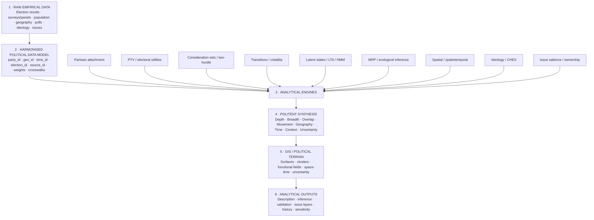

---

# S2. Observed, estimated, derived

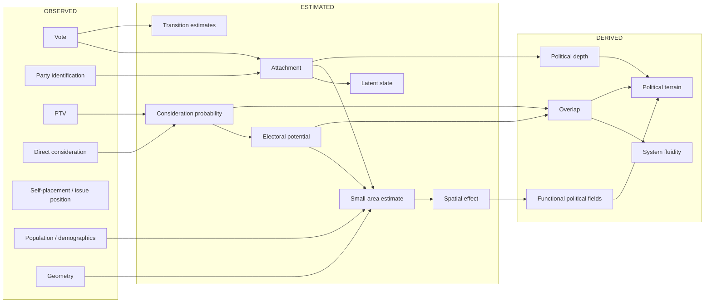

---

# S3. Voter–party dyad

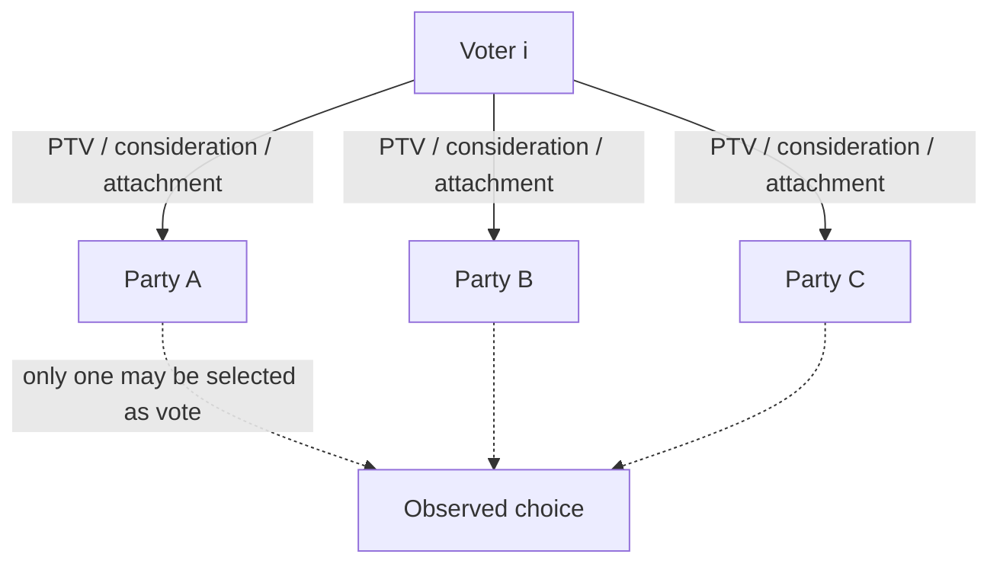

Politent stores relationships to multiple parties rather than reducing the voter to the single selected choice.

---

# S4. Consideration-set / two-hurdle engine

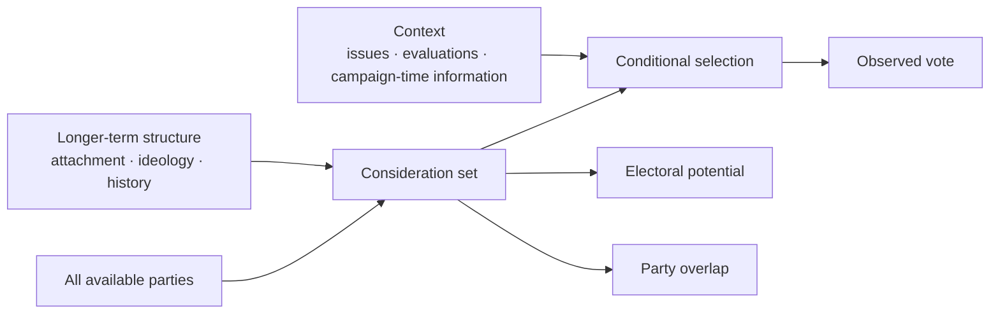

The placement of explanatory variables is empirical rather than mechanically fixed.

---

# S5. Transition matrix

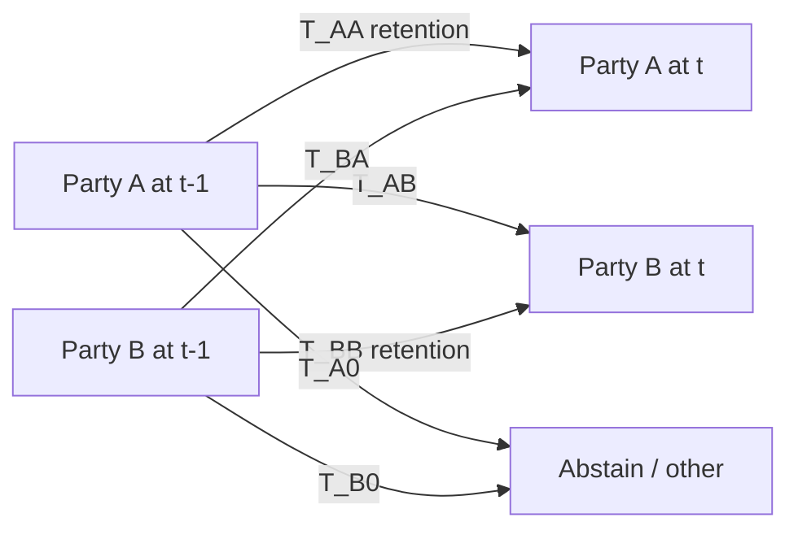

Directional transition is preserved. A↔B is not assumed symmetric.

---

# S6. Overlap versus transition versus ideology

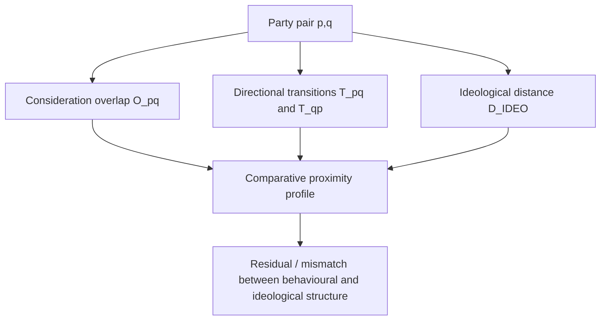

---

# S7. Latent-state engine

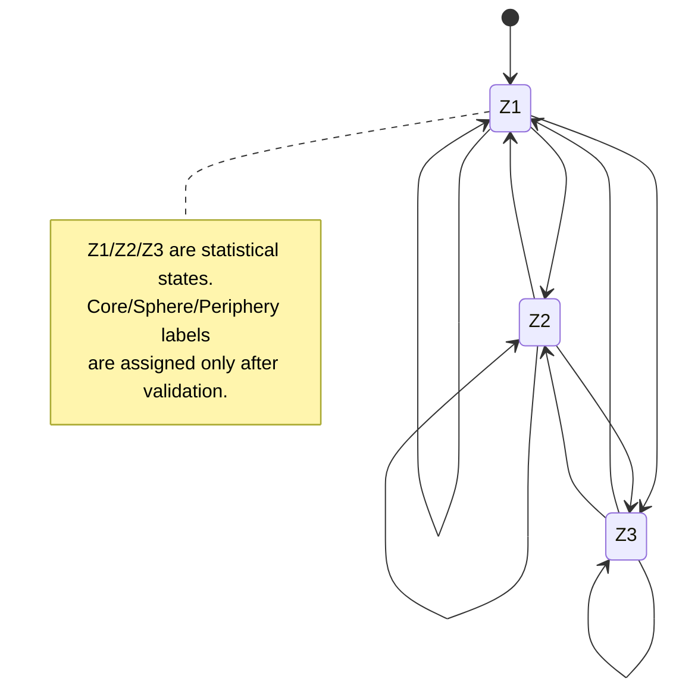

Observed indicators:

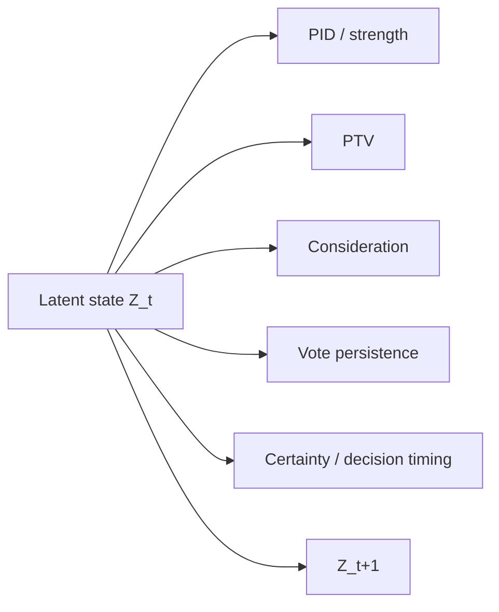

---

# S8. Political terrain representation

```text
┌───────────────────────────────────────────────────────────────┐
│                  ELECTORAL-POTENTIAL FIELD                    │
│                                                               │
│        ┌────────────────────────────────────────────┐         │
│        │          HIGH CONSIDERATION FIELD          │         │
│        │                                            │         │
│        │             ┌────────────────┐             │         │
│        │             │ HIGH ATTACHMENT│             │         │
│        │             │ / PERSISTENCE  │             │         │
│        │             └────────────────┘             │         │
│        │                                            │         │
│        └────────────────────────────────────────────┘         │
│                                                               │
└───────────────────────────────────────────────────────────────┘
```

This is the cartographic origin of the HSm “city / suburb / periphery” metaphor. The contours are generated from data/model estimates rather than assumed in advance.

---

# S9. Multi-scale geography

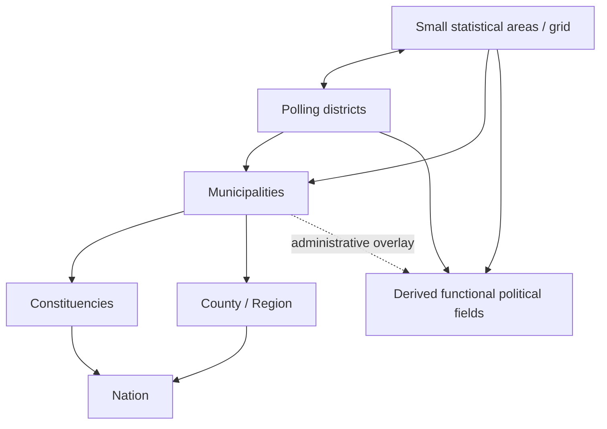

---

# S10. Geometry-version crosswalk

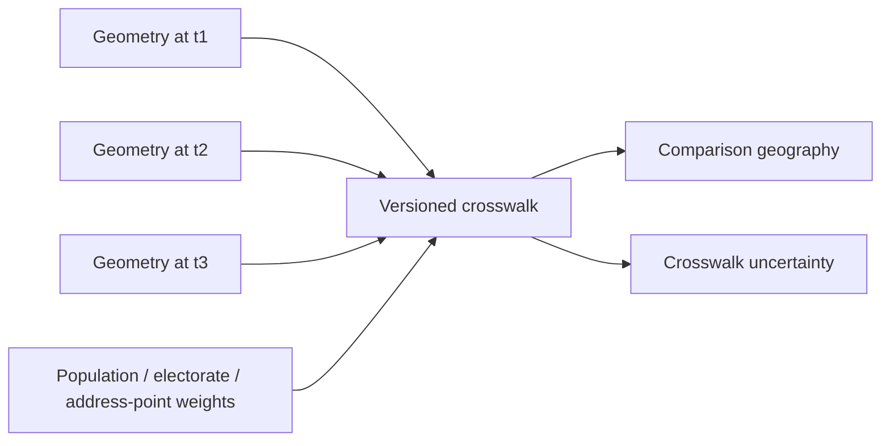

---

# S11. MRP small-area estimation

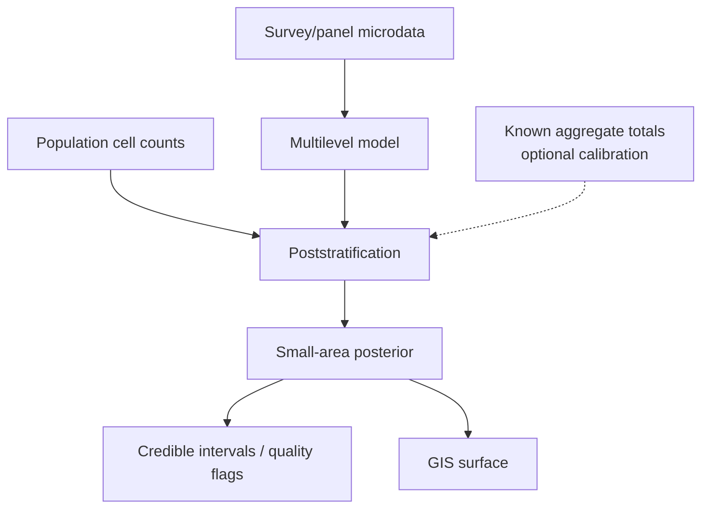

---

# S12. Spatial analytics ladder

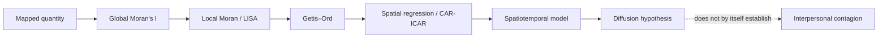

---

# S13. Ideology and behavioural geography

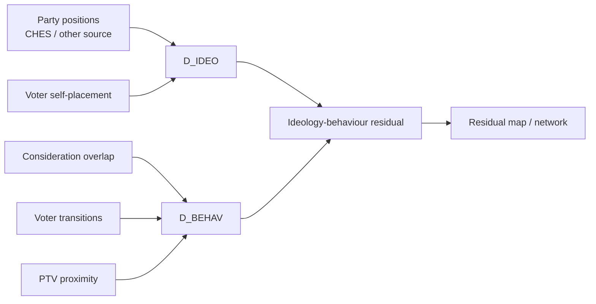

---

# S14. Issue plug-in

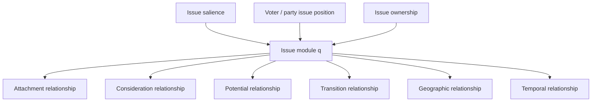

---

# S15. Space-time cube

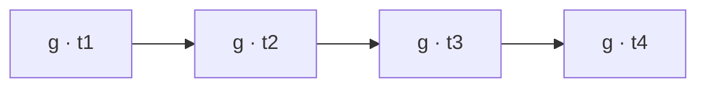

Each location-time cell may contain:

```text
vote_share
attachment_estimate
ptv_mean
consideration_probability
electoral_potential
overlap_metrics
transition_metrics
ideology_metrics
issue_metrics
spatial_effect
uncertainty
source_lineage
model_run_id
```

---

# S16. Functional political fields

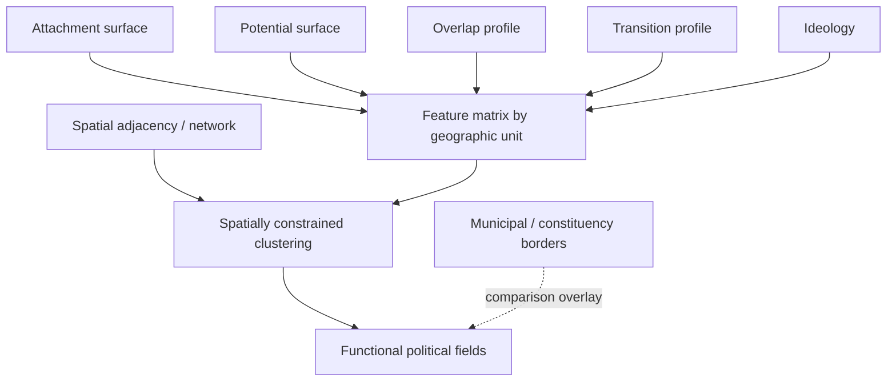

---

# S17. Historical reconstruction

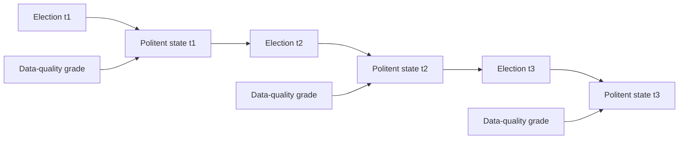

---

# S18. Validation loop

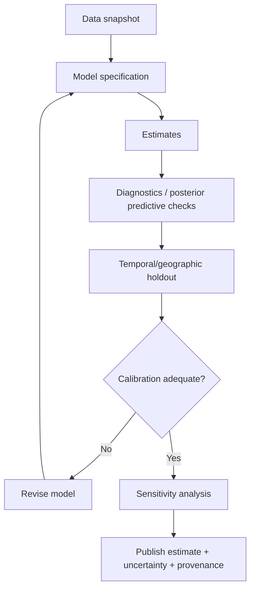

---

# S19. Epistemic-state flow

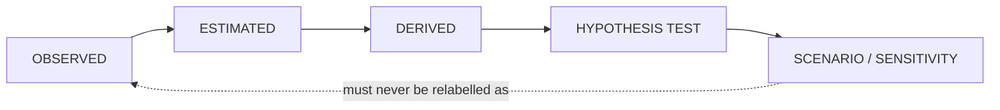

---

# S20. Politent boundary

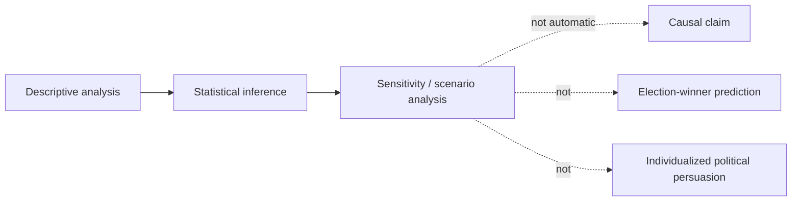
