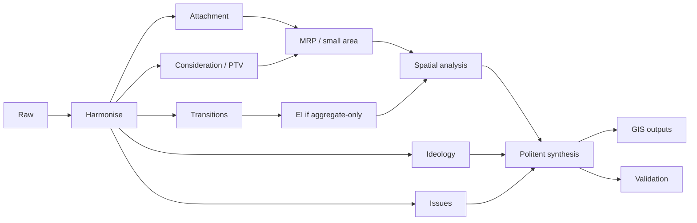

# Politent 3.0 — Technical Implementation Stack

## 1. Architecture

Politent separates:

\[
Data\ engineering
\rightarrow
Statistical\ estimation
\rightarrow
Spatial\ analysis
\rightarrow
GIS\ representation
\rightarrow
Publication
\]

GIS is not expected to fit every model internally.

The preferred pattern is to estimate complex models in Python/R/Stan/INLA and deliver standardized spatial outputs to QGIS, ArcGIS or web mapping.

---

# 2. Recommended open stack

## Database
- PostgreSQL
- PostGIS

## Python
- pandas or polars
- pyarrow
- geopandas
- shapely
- pyproj
- xarray
- libpysal
- esda
- spreg
- networkx
- cmdstanpy / pystan
- scikit-learn for explicitly documented non-spatial preprocessing/clustering

## R
- survey
- brms
- cmdstanr / rstan
- INLA / inlabru
- sf
- terra
- tmap / ggplot2
- targets

## GIS
- QGIS
- optional ArcGIS Pro

## Reproducibility
- Git/GitHub
- Quarto/Markdown
- SQL migrations
- deterministic environment lockfiles
- data manifests
- model-run registry

---

# 3. Repository code structure

```text
src/
  ingest/
  harmonise/
  models/
    attachment/
    consideration/
    transitions/
    latent_states/
    mrp/
    ecological_inference/
    spatial/
    ideology/
    issues/
  gis/
    crosswalk/
    weights/
    surfaces/
    clustering/
    export/
  validation/
  publication/
```

---

# 4. Pipeline



---

# 5. QGIS reusable models

QGIS Model Designer can automate chained geoprocessing tasks.

Documentation:
https://docs.qgis.org/latest/en/docs/user_manual/processing/modeler.html

Suggested models:

```text
01_validate_geometry.model3
02_build_geo_crosswalk.model3
03_join_politent_estimates.model3
04_generate_attachment_surface.model3
05_generate_potential_surface.model3
06_generate_overlap_surface.model3
07_generate_uncertainty_surface.model3
08_export_map_package.model3
```

A QGIS model is a **GIS-processing template**, not a substitute for the upstream statistical model.

---

# 6. ArcGIS Space Time Cube

ArcGIS Pro can create a Space Time Cube for location-by-time analyses.

Documentation:
https://pro.arcgis.com/en/pro-app/latest/tool-reference/space-time-pattern-mining/create-space-time-cube.htm

Possible Politent cube variables:

```text
vote_share
attachment
consideration_probability
electoral_potential
overlap_index
transition_rate
system_fluidity
uncertainty
```

Emerging Hot Spot Analysis can be used for explicit space-time clustering questions, but “hot spot” must not be interpreted automatically as political contagion or causal momentum.

---

# 7. PySAL

PySAL provides open-source spatial weights and exploratory spatial analysis.

Core documentation:
- https://pysal.org/libpysal/
- https://pysal.org/esda/

Indicative workflow:

```python
import geopandas as gpd
from libpysal.weights import Queen
from esda.moran import Moran, Moran_Local

gdf = gpd.read_parquet("electoral_potential.geoparquet")

w = Queen.from_dataframe(gdf)
w.transform = "r"

global_i = Moran(gdf["estimate"], w)
local_i = Moran_Local(gdf["estimate"], w)
```

The production implementation must also store the geometry version and weight specification.

---

# 8. Stan / HMM

Stan provides HMM functions for hidden-state inference.

Documentation:
https://mc-stan.org/docs/functions-reference/hidden_markov_models.html

Politent uses HMM/LTA only where repeated individual observations support state transitions.

Required model comparisons include:

- continuous attachment baseline;
- 2-state model;
- 3-state model;
- 4-state model;
- time-homogeneous versus time-varying transitions where identifiable.

---

# 9. MRP engine

Canonical flow:

```text
survey microdata
      ↓
multilevel response model
      ↓
prediction for all population cells
      ↓
poststratification counts
      ↓
optional calibration to known aggregates
      ↓
small-area posterior distribution
      ↓
GIS surface + uncertainty
```

The population-cell design and all aggregation variables are versioned.

---

# 10. Bayesian spatial engine

INLA is a strong option for latent Gaussian spatial/spatiotemporal models.

Foundation:
https://doi.org/10.1111/j.1467-9868.2008.00700.x

Possible components:

\[
\eta_{gt}
=
X_{gt}\beta
+
u_g^{structured}
+
u_g^{iid}
+
v_t
+
w_{gt}
\]

Alternative Bayesian engines can be used if they satisfy the same model-contract and provenance requirements.

---

# 11. Ecological-inference engine

Gary King EI reference:
https://gking.harvard.edu/publication/a-solution-to-the-ecological-inference-problem-reconstructing-individual-behavior-from-aggregate-data/

Every EI output package must contain:

```text
aggregate margins
model specification
transition estimate
uncertainty
diagnostics
sensitivity specification
epistemic_state = ESTIMATED
method_note = "estimated from aggregate data"
```

---

# 12. CHES ingest

Official source:
https://www.chesdata.eu/ches-europe/

Store:

```text
party_id
ches_party_id
survey_year
left_right
economic_left_right
gal_tan
eu_position
other_issue_dimensions
expert_uncertainty_if_available
```

Do not backfill pre-1999 party coordinates by silently extrapolating CHES.

---

# 13. Suggested API layer

A future Politent service can expose read-only analytical endpoints such as:

```text
GET /parties
GET /geographies
GET /measures
GET /estimate?measure=electoral_potential&party=...
GET /overlap?p=...&q=...
GET /transitions?from=...&to=...
GET /layers/{layer_id}
GET /model-runs/{id}
```

Public APIs should return aggregates and uncertainty, never respondent-level political profiles.

---

# 14. Machine-readable outputs

Each model run should export:

- Parquet/CSV for tabular analysis;
- GeoParquet/GeoPackage for spatial layers;
- JSON diagnostics;
- YAML/JSON provenance;
- model specification;
- uncertainty fields;
- Git commit SHA;
- source snapshot IDs.

---

# 15. Minimal viable build

## MVP-A
- election-result backbone;
- survey/party-dyad harmonisation;
- transition matrices;
- PTV/consideration/electoral potential;
- geography versions/crosswalks;
- basic spatial association;
- uncertainty;
- reproducible GIS layers.

## MVP-B
Adds:
- latent-state models;
- MRP;
- ideology/CHES;
- system fluidity.

## MVP-C
Adds:
- full spatiotemporal models;
- issue plug-ins;
- functional political fields;
- historical reconstruction/backtesting.

The model should mature in this order rather than starting with visually advanced maps before the estimands are validated.
